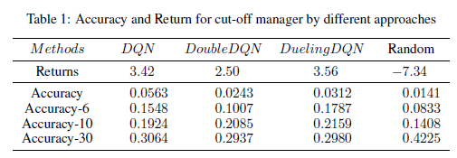

# Advanced Semiconductor Fabrication Factor Prediction with Reinforcement Learning
With the limitation of critical dimension in recent technology, it is difficult to directly scale down semiconductor with common methods. Gate All-Around semiconductor is used to enhance the current scale and stability in advanced fabrication. To better perform read-only memory (ROM), we should further operate breakdown on active regions to provide large enough current (with 0.5V). However, this operation is generally manipulated by hand and causes wasting of power. Hence, we attempted to predict advanced semiconductor fabrication (Gate All-Around Breakdown) factors by reinforcement learning. In case that the dataset is from unpublished papers, the training data we used can't be revealed. We utilized cut-off manager to determine when to pause the breakdown operation. As result, we obtained 43% of accuracy in this dataset. If the model is trained with more dataset, it is convincing that the performace can be significantly improved.

## Dataset
We collected 66748 data points in the semiconductor fabrication procedure. There were 11 features dominating, respectively Vd, Id, Vg, Ig, breakdown order, die number, location, width, length, breakdown on drain, and breakdown on source.

Below graphs display how the the voltage and current change when we exert breakdown on active regions. We could observe significant rise while the voltage reaches above 9V and it goes flat afterwards. Our model is designed to capture this variation.
  
 

## Training Setting
Our cut-off manager is based on Deep-Q-Network and its variants. The input dimension is the same with the feature, which is 11. The output dimension exhibits binary classification.  

## Testing Result
The ablation study compares the performance (accuracy) between strategies in Deep-Q-Networks. 
  

## Contact Info
Author: Chun-Sheng Wu, MS student in Computer Engineering @ Texas A&M University  
Email: jinsonwu@tamu.edu  
LinkedIn: https://www.linkedin.com/in/chunshengwu/

**We are unable to publish our code and data since we signed NDA to the collaborated lab in Naitonal Yang Ming Chiao Tung University**  
*This project was in collaboration with Pei-Hung Chung in Texas A&M University*
